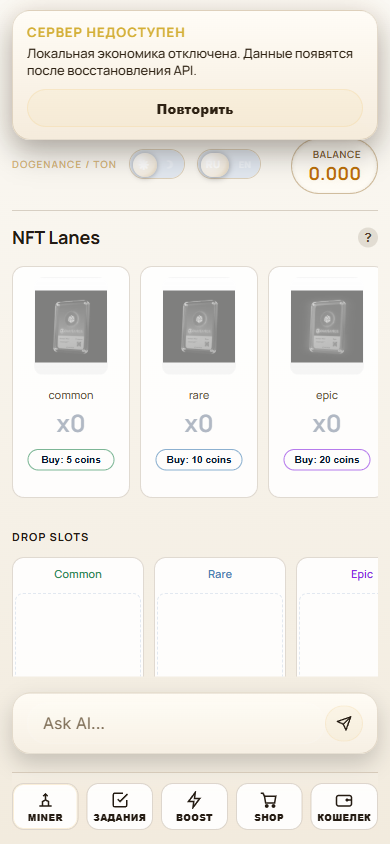

# HookLoot Web3 Game



A game/product prototype that combines gameplay, tasks, wallet flows, backend APIs and monetization experiments.

## Demo

- GitHub: https://github.com/KaimiEwl/hookloot-web3-game
- Live NFT Miner deployment: https://dev.freen8n.space/
- Related playable fishing game: https://kaimiewl.github.io/fishing-game/
- Video: planned
- Case notes: see `docs/architecture.md`

## What it shows

This project shows full-stack product thinking across UI, backend services, persistence, Web3 integrations, E2E checks and load tooling.

## Features

- Game UI and progression mechanics
- Backend API service with migration scripts
- TON wallet/payment integration concepts
- Playwright critical-flow tests
- Load-test and smoke-test tooling

## Tech stack

- Vite
- JavaScript
- Fastify
- Drizzle ORM
- Postgres
- Redis
- TON Connect
- Playwright
- autocannon

## Local setup

```
npm install
npm run dev
```

## Verification

```
npm run test
npm run server:test
npm run build
```

## Status

Prototype export. Production payment credentials and private deployment artifacts are excluded.

## Security and cleanup

This public repository is a clean portfolio export. It intentionally excludes production secrets, local databases, logs, generated media, backups, runtime folders and private deployment artifacts.
